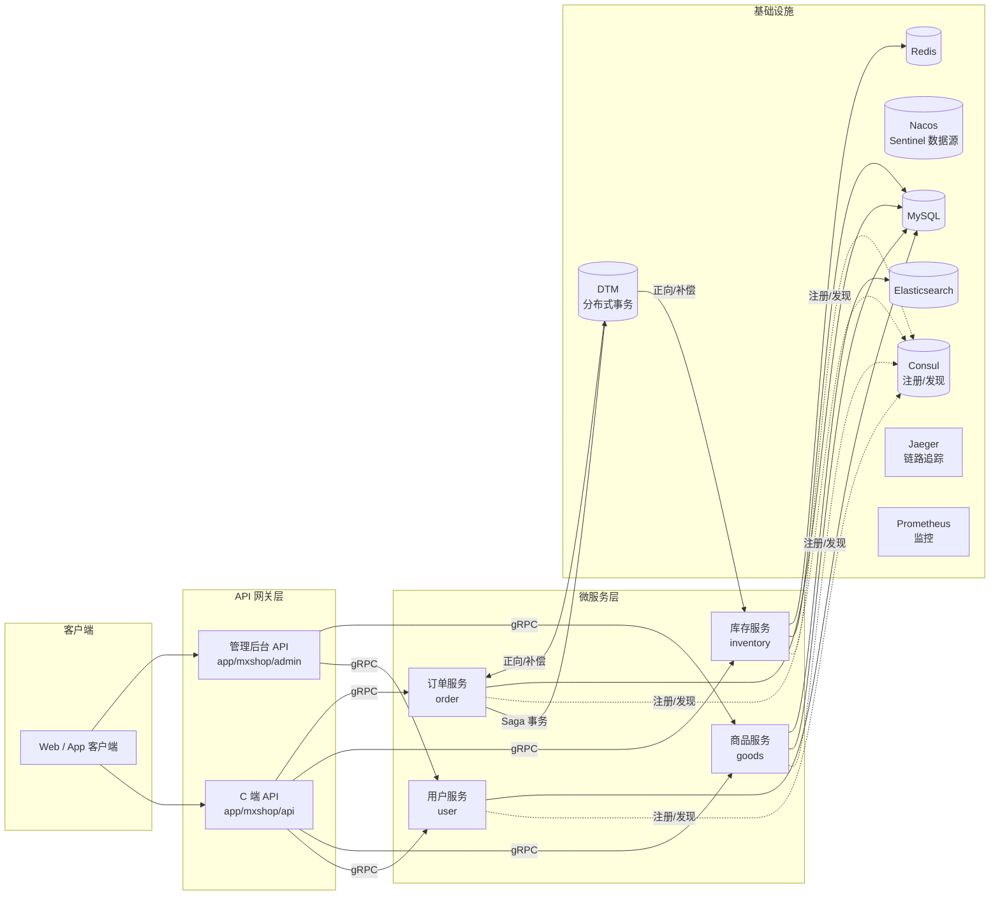

# MXShop 微服务商城

<div align="center">

一个基于 **Go + gRPC** 的微服务电商项目，内置自研微服务框架 [gmicro](#-微服务框架-gmicro)，覆盖用户、商品、库存、订单四大后端服务与 API 网关，是学习 Go 微服务架构与分布式系统的实战项目。

[](https://go.dev/dl/)
[](https://grpc.io/)
[](https://gin-gonic.com/)

</div>

## 目录

- [MXShop 微服务商城](#mxshop-微服务商城)
  - [目录](#目录)
  - [功能特性](#功能特性)
  - [系统架构](#系统架构)
  - [服务现状](#服务现状)
  - [技术栈](#技术栈)
    - [核心框架](#核心框架)
    - [中间件](#中间件)
    - [其他](#其他)
  - [目录结构](#目录结构)
  - [快速开始](#快速开始)
    - [1. 环境准备](#1-环境准备)
    - [2. 获取代码](#2-获取代码)
    - [3. 配置](#3-配置)
    - [4. 启动服务](#4-启动服务)
    - [5. 静态检查](#5-静态检查)
  - [微服务框架 gmicro](#微服务框架-gmicro)

## 功能特性

- **微服务架构**：用户、商品、库存、订单四大后端服务 + C 端 / 管理后台双 API 网关
- **自研微服务框架 `gmicro`**：统一管理 gRPC/REST 服务生命周期、健康检查、优雅退出
- **服务注册与发现**：基于 Consul 的服务注册、发现与负载均衡
- **分层架构**：Controller → Service → Data（结合 DDD 领域模型）
- **依赖注入**：使用 Wire 自动装配各层依赖
- **分布式事务**：基于 DTM（Saga 模式）保证跨服务数据一致性
- **链路追踪**：OpenTelemetry + Jaeger / Zipkin
- **可观测性**：Prometheus + Grafana，内置 `/metrics` 与 `pprof` 性能分析
- **流量防护**：Sentinel 限流熔断（Nacos 数据源）
- **认证鉴权**：JWT 登录鉴权
- **参数校验**：validator 请求参数校验
- **日志**：Zap + 文件滚动，支持多输出

## 系统架构

```
客户端 (Web / App)
        │  HTTP
        ▼
┌──────────────────────────────────────┐
│          API 网关层 (Gin)            │
│  ┌──────────────┐  ┌──────────────┐  │
│  │  C 端 API     │  │ 管理后台 API  │  │
│  │ app/mxshop/api│  │app/mxshop/admin│ │
│  └──────┬───────┘  └──────┬───────┘  │
└─────────┼─────────────────┼──────────┘
          │ gRPC            │ gRPC
          ▼                 ▼
┌──────────────────────────────────────┐
│           微服务层 (gRPC)            │
│   user    goods   inventory   order  │
│  用户服务 商品服务  库存服务   订单服务  │
└───┬───────┬─────────┬──────────┬────┘
    │       │         │          │
    ▼       ▼         ▼          ▼
  MySQL   MySQL     MySQL      MySQL
          + ES      + Redis    + DTM
```



## 服务现状

各服务默认端口定义于 `configs/` 目录下的对应配置文件，可根据需要修改。

| 服务 | 注册名（Consul） | gRPC 端口 | HTTP 端口 | 职责 | 说明 |
|------|-----------------|----------|----------|------|------|
| user | `mxshop-user-srv` | 8025 | 8022 | 用户注册、登录、信息管理、验证码 | [查看](app/user/README.md) |
| goods | `mxshop-goods-srv` | 8018 | 8051 | 商品、分类、品牌、轮播图，ES 搜索 | [查看](app/goods/README.md) |
| inventory | `mxshop-inventory-srv` | 8019 | 8052 | 库存查询、扣减、归还（Redis 分布式锁） | [查看](app/inventory/README.md) |
| order | `mxshop-order-srv` | 8020 | 8053 | 订单管理、购物车、DTM 分布式事务 | [查看](app/order/README.md) |
| api（C 端网关） | `mxshop-api` | 8017 | 8051 | 面向前端用户的 RESTful API | [查看](app/mxshop/README.md) |
| admin（后台网关） | `mxshop-admin` | 8016 | 8050 | 面向管理后台的 API | [查看](app/mxshop/README.md) |

## 技术栈

### 核心框架

| 类别 | 技术 | 说明 |
|------|------|------|
| 语言 | Go 1.25+ | 开发语言 |
| Web 框架 | Gin | HTTP 网关 |
| RPC 框架 | gRPC | 服务间通信 |
| ORM | GORM | 数据访问 |
| 配置管理 | Viper | 配置文件解析 |
| 日志 | Zap | 结构化日志 |
| 依赖注入 | Wire | 编译期依赖装配 |

### 中间件

| 类别 | 技术 | 说明 |
|------|------|------|
| 数据库 | MySQL | 业务数据存储 |
| 缓存 | Redis | 缓存与分布式锁 |
| 搜索引擎 | Elasticsearch | 商品搜索 |
| 服务注册/发现 | Consul | 服务治理 |
| 配置中心 / 限流 | Nacos + Sentinel | 配置与流量防护 |
| 分布式事务 | DTM | Saga 事务调度 |
| 链路追踪 | OpenTelemetry + Jaeger/Zipkin | 调用链追踪 |
| 监控 | Prometheus + Grafana | 指标采集与展示 |

### 其他

- 认证：JWT（`gin-jwt`）
- 参数校验：`go-playground/validator`
- 短信：阿里云 SMS
- 图形验证码：`base64Captcha`
- 分布式 ID：Sonyflake

## 目录结构

```
mxshop_refactor/
├── api/                    # Protobuf API 定义（user/goods/order/inventory）
├── app/                    # 应用层
│   ├── user/               # 用户服务
│   ├── goods/              # 商品服务
│   ├── inventory/          # 库存服务
│   ├── order/              # 订单服务
│   ├── mxshop/             # API 网关（api + admin）
│   └── pkg/                # 应用层公共代码（code/options/translator 等）
├── cmd/                    # 各服务启动入口
│   ├── user/  goods/  inventory/  order/   # 微服务
│   └── shop/  admin/                        # 网关
├── configs/                # 各服务配置文件
├── gmicro/                 # 自研微服务框架
│   ├── app/                # 应用生命周期管理
│   ├── code/               # 统一错误码
│   ├── core/               # metric / trace
│   ├── registry/           # 服务注册（Consul）
│   └── server/             # rpcserver / restserver
├── pkg/                    # 通用工具库（db/log/errors/storage 等）
├── third_party/            # 第三方 proto 依赖
├── build/                  # Docker / Jenkins 构建配置
├── scripts/                # 脚本工具
├── tools/                  # 代码生成工具
├── docs/                   # 学习文档
├── test/                   # 测试与静态检查
└── note.md                 # 学习笔记（分层架构 / 分布式事务 / Kafka 等）
```

## 快速开始

### 1. 环境准备

| 依赖 | 版本 | 是否必需 |
|------|------|----------|
| Go | 1.25+ | 必需 |
| MySQL | 5.7+ / 8.x | 必需 |
| Redis | 5.0+ | 必需（库存/网关） |
| Consul | 1.12+ | 必需（服务注册） |
| Elasticsearch | 7.x | 可选（商品搜索） |
| Nacos | 1.x | 可选（Sentinel 限流） |
| DTM | 1.x | 可选（订单分布式事务） |

### 2. 获取代码

```bash
git clone https://github.com/leleares/mxshop-refactor.git
cd mxshop-refactor
go mod download
```

### 3. 配置

每个服务的配置文件位于 `configs/` 目录，需按实际情况修改数据库、Redis、Consul 等连接信息：

```bash
# API 网关使用配置模板（api.yaml 已被 .gitignore 忽略）
cp configs/shop/api.yaml.example configs/shop/api.yaml
vim configs/shop/api.yaml

# 各微服务配置（默认已存在，按需修改）
vim configs/user/srv.yaml
vim configs/goods/srv.yaml
vim configs/inventory/srv.yaml
vim configs/order/srv.yaml
```

> 部分配置文件中已内置本地开发默认值（如 MySQL 密码 `12345678`、Nacos 地址）。部署到生产环境前，请务必替换为真实凭据并妥善管理敏感信息。

### 4. 启动服务

```bash
# 启动微服务
go run cmd/user/user.go          # 用户服务
go run cmd/goods/goods.go        # 商品服务
go run cmd/inventory/inventory.go # 库存服务
go run cmd/order/order.go        # 订单服务

# 启动 API 网关
go run cmd/shop/api.go           # C 端网关
go run cmd/admin/admin.go        # 管理后台网关
```

启动后可通过以下内置接口进行健康检查与监控：

- 健康检查：`http://<host>:<http-port>/healthz`
- 指标：`http://<host>:<http-port>/metrics`
- 性能分析：`http://<host>:<http-port>/debug/pprof/`

### 5. 静态检查

项目使用 `golangci-lint` 进行代码检查，配置见 [`.golangci.yml`](.golangci.yml)：

```bash
golangci-lint run
```

## 微服务框架 gmicro

`gmicro` 是项目自研的微服务框架，位于 [gmicro/](gmicro/) 目录，负责 gRPC/REST 服务从启动到退出的一整套生命周期管理，屏蔽了底层服务治理的细节：

- **`app`**：应用启动、装配与优雅退出
- **`server`**：rpcserver / restserver 服务抽象
- **`registry`**：服务注册与发现（Consul 实现）
- **`code`**：统一错误码与错误处理
- **`core`**：metric（监控指标）与 trace（链路追踪）中间件

> 无论是 gRPC 服务还是 HTTP 服务，均交由 `gmicro` 统一约束与管理，业务方只需关注各层实现。


